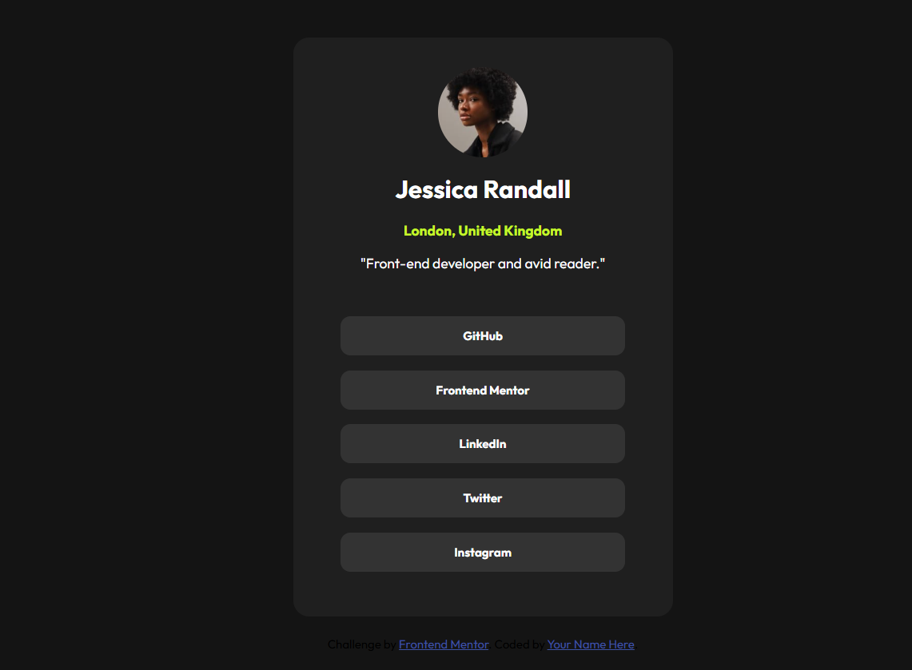

# Perfil de Enlaces Sociales 👨‍💻

Un diseño responsive de Frontend Mentor que muestra un perfil profesional con enlaces a redes sociales.

---

## 🚀 Características

- 📱 Diseño responsive (Mobile 375px / Desktop 1440px)
- 🎨 Paleta de colores profesional (grises y verde acento)
- 🔗 Enlaces a redes sociales reales
- ✨ Efectos de hover interactivos

---

## 🛠️ Construido con

  

---

## 🌐 Live demo

🧷[Ver Social Link](https://eclectic-belekoy-423bee.netlify.app/)

---

## 📷 Diseño



---

## 📂 Estructura de archivos

```
text
social-links-profile/
│
├── index.html # Estructura principal
├── css/
│ └── style.css # Estilos personalizados
├── assets/
│ └── images/ # Assets visuales
└── style-guide.md # Guía de diseño
```

---

## 🙋 Créditos

🏆 Reto de Frontend Mentor

💻 Implementado por Gabriel Velozo

---

## 🙋 Acerca de mi

- 🐤 [_Twitter_](https://x.com/Gabiitto_)
- 💼 [_LinkedIn_](https://www.linkedin.com/in/velozogabriel/)
- 📷 [_Instagram_](https://www.instagram.com/gabittovelozo/?hl=es)
- 😺 [_GitHub_](https://github.com/Gabrielvelozo)
